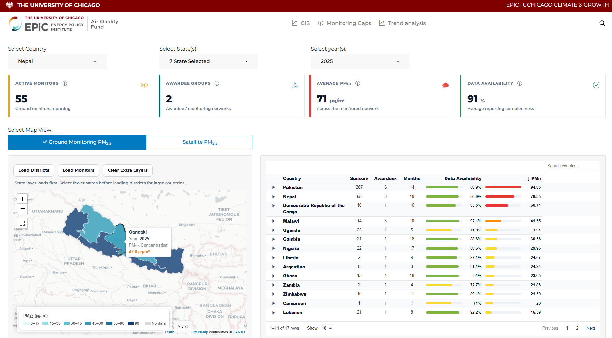

# AQFund

AQFund is an interactive financial analytics dashboard built with **R** and **Shiny**. It provides a structured interface for exploring market data, monitoring financial metrics, reviewing tabular datasets, and presenting analytical results through responsive charts and visual components.

<p align="center">
  
</p>

## Overview

The application combines financial-data processing with an interactive dashboard experience. Its modular architecture separates data access, analysis, and presentation logic, making the project easier to maintain, extend, and deploy.

AQFund uses reproducible dependency management through `renv`, ensuring that contributors and deployment environments use the same package versions.

## Key Features

- Interactive financial dashboards built with Shiny
- Market and time-series analysis using `quantmod`, `TTR`, `xts`, and `zoo`
- Responsive visualizations with `ggplot2`, `plotly`, `highcharter`, and `billboarder`
- Searchable and sortable datasets using `DT` and `reactable`
- Database integration through `DBI`, `RSQLite`, and `dbplyr`
- Efficient data processing with `dplyr`, `data.table`, `tidyr`, and `arrow`
- Geographic visualization support with `leaflet`, `sf`, and `terra`
- Reproducible environments managed through `renv`

## UI Components

The interface is organized into reusable UI components rather than tightly coupled page logic. Each component can contain its own controls, outputs, validation states, and server-side behavior.

Typical components include:

- Dashboard summaries and key performance indicators
- Financial charts and time-series visualizations
- Interactive data tables
- Filters, selectors, and date controls
- Geographic and market maps
- Loading, authentication, and notification states

This component-based structure helps keep the interface consistent while allowing individual sections to evolve independently.

## Technology Stack

| Area | Technologies |
| --- | --- |
| Application | R 4.6.0, Shiny |
| Data processing | tidyverse, dplyr, data.table, tidyr, purrr |
| Financial analysis | quantmod, TTR, xts, zoo |
| Visualization | ggplot2, plotly, highcharter, billboarder |
| Tables | DT, reactable |
| Databases | DBI, RSQLite, dbplyr |
| Spatial data | leaflet, sf, terra, rnaturalearth |
| Environment management | renv |
| Deployment | rsconnect |

## Getting Started

### Prerequisites

Install the following before running the application:

- R 4.6.0 or a compatible version
- RStudio or another R development environment
- Git

### Installation

Clone the repository:

```bash
git clone <repository-url>
cd <repository-name>
```

Open R in the project directory and restore the locked dependencies:

```r
install.packages("renv")
renv::restore()
```

### Run the Application

From the project root, run:

```r
shiny::runApp()
```

The application will start locally and print its access URL in the R console.

## Dependency Management

Dependencies are recorded in `renv.lock`. When adding or updating packages, refresh the lockfile with:

```r
renv::snapshot()
```

To restore the exact project environment on another machine:

```r
renv::restore()
```

Commit changes to `renv.lock` whenever project dependencies change.

## Dashboard Image

The dashboard preview used in this README is expected at the repository root:

```text
aqfund.png
```

Keep the filename unchanged so the GitHub preview renders correctly.

## Development Guidelines

- Keep UI components modular and reusable.
- Separate presentation logic from data-processing logic.
- Avoid committing credentials, tokens, or private configuration files.
- Store secrets in environment variables or deployment-specific secret management.
- Run `renv::snapshot()` after intentional dependency changes.
- Test the dashboard at desktop and mobile viewport sizes before deployment.

## Deployment

The project includes `rsconnect`, allowing deployment to compatible Posit hosting environments. Configure the required account and deployment target before publishing the application.

Example:

```r
rsconnect::deployApp()
```

Deployment credentials and environment-specific secrets should never be committed to the repository.

## Contributing

Contributions should be focused, documented, and tested before submission.

1. Create a new branch for the change.
2. Implement and test the update locally.
3. Update `renv.lock` when dependencies change.
4. Submit a pull request with a clear description of the change.

---

Built with R and Shiny.
